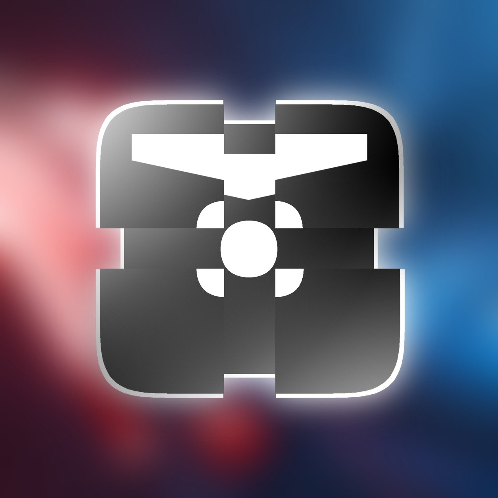

<div align="center">



<br/>

**Diffusion-based motion AI for Beat Saber**

[](../../issues/new?template=request_replay.yml)
[](LICENSE)

</div>

---

## What is this

BeatNet generates full-body motion replays (`.bsor`) for any Beat Saber map. It doesn't use scripted movements or hardcoded patterns — it learned how humans play by watching thousands of real replays from BeatLeader.

The core is a **transformer-based diffusion model** trained on ~400k windows of real player motion data (head + both hands at 90fps). Given a beatmap's note sequence, it denoises gaussian noise into realistic saber trajectories frame by frame. Think of it like stable diffusion, but instead of generating images it generates 3D hand movements.

## How it works

```
beatmap notes → [Note Encoder] → context
                                    ↓
random noise → [Diffusion Decoder] → denoised motion (128 frames)
                                    ↓
                          overlap + blend windows
                                    ↓
                              full replay .bsor
```

1. **Note Encoder** — A 4-layer transformer that reads the upcoming 12 notes and encodes their positions, colors, and cut directions into a context vector..
2. **Diffusion Decoder** — A 6-layer transformer decoder that takes noisy motion + timestep + note context and predicts the clean motion. We run this for 50 DDIM steps (or 15 for fast mode) to progressively denoise..
3. **Windowed generation** — The song is split into overlapping 128-frame windows (~1.4s each). Each window is generated independently and blended with its neighbors using hanning weights for smooth transitions..
4. **Post-processing** — 6D rotation representations are converted back to quaternions, poses are smoothed with a 5-frame filter, and everything is packed into the BSOR binary format with simulated note hit events..

## Request a replay

Want to see the AI play your favorite map? Just [open an issue](../../issues/new?template=request_replay.yml) with the BeatSaver map key and difficulty. The bot will generate a `.bsor` file and post it back automatically.

**Limits:**
- 3 replays per day per user (GitHub Actions has limited compute)
- Maps under 5 minutes only
- Generation takes ~10-15 min on CPU

## Run locally

If you have your own trained weights, you can generate replays locally:

```bash
pip install torch numpy scipy

python generate_replay.py "path/to/map/folder" ExpertPlus \
    --model your_model.pt \
```

> **Note:** Model weights are not included in this repo. The generation service runs through GitHub Actions only.

## Project structure

```
├── model.py              # transformer architecture (encoder + decoder)
├── rotation_utils.py     # quaternion ↔ 6D rotation conversions
├── generate_replay.py    # inference + BSOR writer
├── github_bot.py         # issue → replay automation
├── .github/
│   ├── workflows/
│   │   └── generate_replay.yml
│   └── ISSUE_TEMPLATE/
│       └── request_replay.yml
└── assets/
    └── banner.jpg
```

## Tech stack

- **PyTorch** — model + training + inference
- **DDIM sampling** — fast deterministic generation (50 steps instead of 1000)
- **BSOR format** — Beat Saber Open Replay, compatible with BeatLeader and replay mods
- **GitHub Actions** — free serverless compute for on-demand generation

## Acknowledgments

- [BeatLeader](https://beatleader.xyz) for the replay API and player data
- [BeatSaver](https://beatsaver.com) for the map hosting and API
- Trained on Kaggle's free T4 GPUs

## License

MIT — Do whatever you want with the code. Model weights are not distributed.
